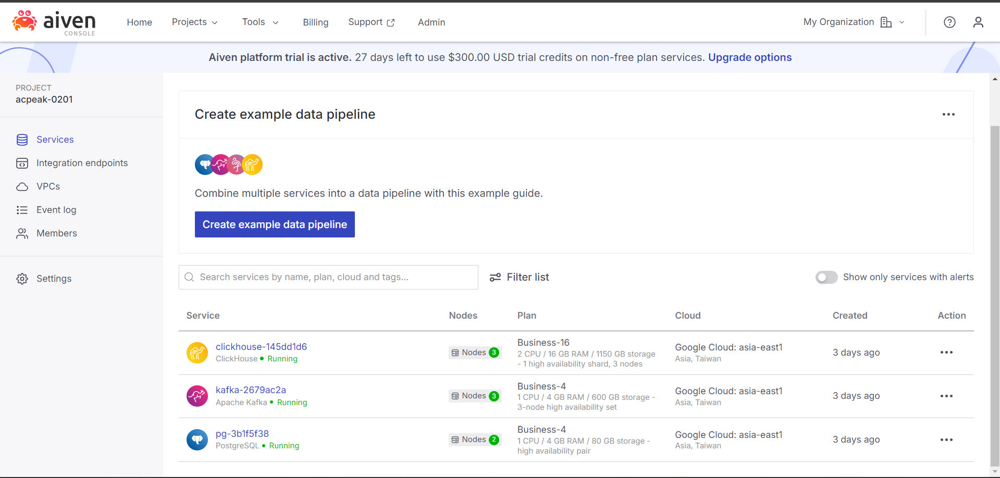

# 🚀 LaunchPad

## Overview

LaunchPad is a versatile platform designed to simplify the process of deploying and hosting static websites and web applications. Whether you're working with simple HTML/CSS/JS files or complex React/Framer apps, LaunchPad has you covered. The platform is built using a modern tech stack and supports robust deployment capabilities with validation features that make hosting your projects seamless.

## ✨ Key Features

- **Effortless Deployment:** Deploy your static or dynamic web applications with just a few clicks.
- **Validation Logic:** Automatically detect and validate whether the project is static (HTML, CSS, JS) or dynamic (React, Next.js) before deploying.
- **User-Friendly UI:** A sleek and intuitive interface for managing your deployments.
- **Scalable Infrastructure:** Built to handle projects of all sizes, from small personal sites to large enterprise applications.

## 🛠️ Tech Stack

- **Backend:** Node.js, Express.js
- **Frontend:** React, TypeScript
- **Database:** PostgreSQL (via Aiven)
- **Message Queue:** Kafka (via Aiven)
- **Data Storage:** ClickHouse (via Aiven)
- **Infrastructure:** AWS S3, ECS, ECR
- **Orchestration:** Docker
- **Caching:** Redis
- **Proxy:** NGINX (Reverse Proxy)

## 📐 Architecture

LaunchPad's architecture is designed for scalability, reliability, and performance. Below is an illustration of the architecture:


An updated version of the architecture:


### Explanation

- **User Interface (React):** Provides an intuitive UI for users to manage their deployments, view logs, and access analytics.
- **API Gateway (Express):** Manages requests and routes them to the appropriate services.
- **Message Queue (Kafka):** Handles asynchronous tasks and event-driven architecture.
- **Database (PostgreSQL):** Stores user data, project configurations, and other essential data.
- **Data Analytics (ClickHouse):** Processes and stores logs and visitor analytics for deployed projects.
- **Object Storage (AWS S3):** Stores static assets and deployment files.
- **Container Orchestration (ECS):** Manages Docker containers for deployment environments.
- **Reverse Proxy (NGINX):** Routes incoming traffic to the appropriate services based on the request type.

# 🚀 Getting Started with LaunchPad

Follow these steps to get started with LaunchPad:

## 1. Clone the Repository

```bash
git clone https://github.com/CoderSwarup/Vercel_Clone.git
cd launchpad
```

## 2. Folder Structure

The repository contains the following folders:

[api-server](api-server): The server handling API requests.
[build-server](build-server): The server responsible for building and deploying the project.
[url-reverse-proxy](url-reverse-proxy): The reverse proxy configuration.
[vercel-clone-frontend](vercel-clone-frontend): The frontend application

## 3. Environment Variables

For `api-server`
Create a `.env` file in the api-server directory with the following content:

```env
AWS_ACCESSKEYID=
AWS_SECRETACCESSKEY=

AWS_CLUSTER_ARN=
AWS_TASK_DEF_ARN=

# Upstash Redis
REDIS_HOST=
REDIS_PORT=
REDIS_PASSWORD=

DATABASE_URL=

# ClickHouse
CLICK_HOUSE_URL=
CLICK_HOUSE_DB=
CLICK_HOUSE_USERNAME=
CLICK_HOUSE_PASSWORD=

# Kafka
KAFKA_BROKER_URL=
KAFKA_USER_NAME=
KAFKA_PASSWORD=
```

For `build-server`
Create a `.env` file in the build-server directory with the following content:

```env
AWS_ACCESSKEYID=
AWS_SECRETACCESSKEY=

REDIS_HOST=
REDIS_PORT=
REDIS_PASSWORD=
```

For `url-reverse-proxy`
Create a `.env` file in the url-reverse-proxy directory with the following content:

```env
OUTPUT_BASE_PATH=
DATABASE_URL=
KAFKA_BROKER_URL=
KAFKA_USER_NAME=
KAFKA_PASSWORD=

```

## 4. Test Container Locally

to build the image

```
cd build-server

docker build -t build-server .
```

To test the container locally, run:

```bash
 docker run -it -e GIT_REPOSITORY__URL=https://github.com/SafdarJamal/vite-template-react.git
                -e PROJECT_ID=1
                -e DEPLOYEMENT_ID=<DEPLOYMENTID>
                 -e AWS_ACCESSKEYID=<YOURKEY>
                 -e AWS_SECRETACCESSKEY=<YOURKEY>
                 -e KAFKA_BROKER_URL=<YOUR_URL>
                 -e KAFKA_USER_NAME=avnadmin
                 -e KAFKA_PASSWORD=<YOU_PASSWORD> builder-server

```

# 🌐 Deployment

LaunchPad can be deployed on any cloud platform. Here’s an example setup using AWS:

- **Set Up S3 Buckets:** For storing static assets.
- **Deploy Docker Containers:** Use ECS to manage your Docker containers.
- **Configure Load Balancer:** Set up an AWS ELB to distribute traffic across your containers.
- **Set Up Aiven Services:** Utilize Aiven for managed Kafka, PostgreSQL, and ClickHouse services.

# 🛡️ Security

LaunchPad prioritizes security with the following measures:

- **Authentication:** All sensitive operations require authentication and are protected by JWT.
- **Encryption:** Data at rest and in transit is encrypted using industry-standard techniques.
- **Access Control:** Role-based access control ensures that only authorized users can perform critical operations.

# 📊 Monitoring and Analytics

LaunchPad integrates with ClickHouse to provide real-time analytics on visitor data, project usage, and system performance. You can view detailed reports via the UI.

# 📝 Aiven.io Integration

LaunchPad utilizes [Aiven.io](https://aiven.io) for managed Kafka, PostgreSQL, and ClickHouse services, ensuring reliability and scalability.



# ❤️ Acknowledgements

Thank you for exploring LaunchPad! If you have any questions or suggestions, feel free to reach out.

Happy coding! 🚀
